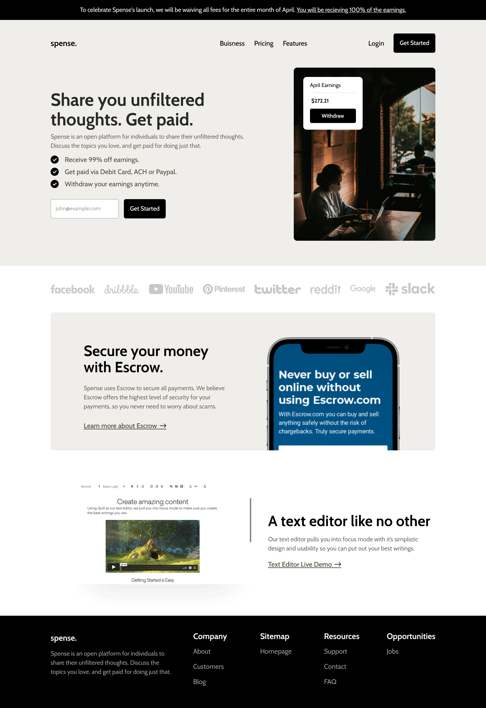
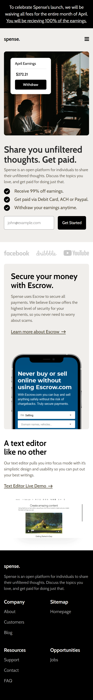

# Welcome 👋

# Spense Landing Page Project.

## Spense is a Frontend Coding challenge landing page from the <u>_[Codewell](https://www.codewell.cc/challenges/spense-landing-page--608a7a859691700015db16c5)_</u>

### This landing page project built with:

- HTML5
- SCSS
- JS

Spense is Mobile first fully responsive website. I use ViteJs just for Compile SCSS to CSS. I use many CSS good features like grid & subgrid. This site have very basic form validation in hero section including error and success message based on user given input.

> This is my First Challenge from Codewell and not a paid user and codewell don't give me the figma file, so this website may not be a pixel perfect but i tried hard to give it a good look hope those of you are here for watch my solution you guys will not be disappointed.<b> <u>Honest Feedback is always welcome.</u> </b>

## Live link:

- ### <b> <u>_[Netlify](https://codewell-spense-landing-page.netlify.app/)_<u/></b>

## Shoots

Desktop View

Mobile View

